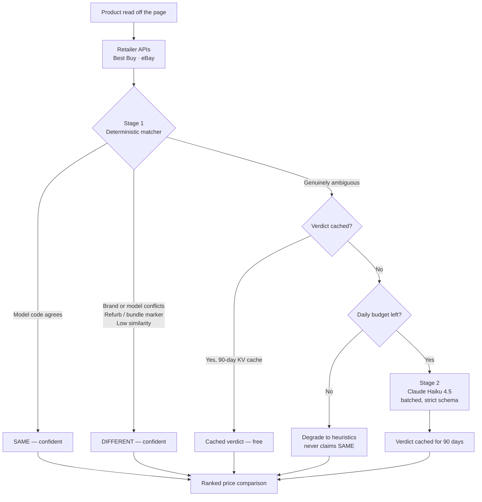

# Spread

**See what the product you're looking at actually costs everywhere else.**

[](https://github.com/jamespost1/super-shopper/actions/workflows/ci.yml)
[](tests/)
[](evals/)
[](public/manifest.json)
[](LICENSE)

Spread is a Chrome extension that puts a **Compare price** button on product pages at Amazon,
Target, Walmart, Best Buy, eBay and Costco. Click it and you get the real, current price for the
*same* product at other retailers — shipping folded in, no coupon spam, no affiliate bait.

There is nothing to configure. Install it and it works.

---

## The actual hard problem

Fetching prices is easy. Knowing whether two listings are **the same purchasable item** is not.

Consider these two titles:

```
Apple Watch Series 9 GPS 45mm Midnight Aluminum
Apple Watch Series 8 GPS 45mm Midnight Aluminum Case
```

They are 88% identical as strings and share 100% of their meaningful tokens. They are different
products, a hundred dollars apart. Now consider:

```
Sony WH-1000XM5 Wireless Noise Canceling Headphones
Sony WH1000XM5 Over-Ear Bluetooth Headphone, Black
```

Those share almost no wording. They are the same headphones.

**String similarity is actively misleading here** — it scores the wrong pair higher than the right
one. Showing a shopper a price for a product they aren't looking at is the single worst thing this
extension can do, so the matching engine is the heart of the project.

## How Spread solves it: a two-stage cascade



**Stage 1** is deterministic, free and instant: model-code extraction, brand gating, pack-size
comparison, and a blend of Jaccard, containment and Levenshtein similarity. It resolves the clear
cases and — crucially — reports when it *cannot* decide.

**Stage 2** sends only the ambiguous pairs to Claude, batched into a single request per comparison.

### The design rule that made it work

The first version let a high fuzzy score declare a match. The eval harness measured that at
**50% precision** — half of all claimed matches were wrong, including confidently pairing a Series 9
watch with a Series 8.

The fix was to make one rule absolute: **fuzzy scoring may reject a match, but may never confirm
one.** A confident `SAME` is earned only by a decisive signal — a matching manufacturer model field,
or a model code mined from both titles. Everything else goes to Stage 2 or gets rejected.

| Configuration | Accuracy | Precision | Recall | F1 |
|---|---|---|---|---|
| Fuzzy scoring may confirm | 60.0% | 50.0% | 50.0% | 0.500 |
| **Decisive signals only** (current) | **80.0%** | **100.0%** | 50.0% | 0.667 |
| Full cascade (Stage 1 + Claude) | run `npm run eval:llm` | | | |

Measured by [`evals/run.mjs`](evals/run.mjs) over a [labeled set](evals/fixtures/product-pairs.json)
of deliberately hard pairs — adjacent model generations, capacity variants, bundles, refurbished
units, and correct matches buried in marketplace keyword spam. CI fails if precision drops below 90%.

## Price history, and why it carries the product

The free retailer APIs cover a narrow slice of the catalog -- Best Buy is
electronics, and Amazon and Target publish no open product API at all. So on most
product pages, a pure comparison tool has nothing to say. An extension that
usually returns "no matches found" does not survive on anyone's toolbar.

Spread therefore records the price on every supported product page it opens.
That gives it something useful on every page, independent of any API:

> **$328.00** now · **$328.00** lowest seen · **$399.99** highest seen
> This is the lowest price in 84 days.

The same records accumulate into cross-retailer coverage that grows with usage
rather than being capped by which APIs will have us -- when one person views a
product on Best Buy and another views it on Amazon, that is a real observed price
pair. This is where the product key in [`src/core/product-key.js`](src/core/product-key.js)
earns its keep, and why it is deliberately conservative: it must derive matching
identities from two listings *independently*, with no pair to compare, and a
collision would merge two products into one history and show a price that was
never real. When identity cannot be established confidently, nothing is recorded.

Only a model-derived key is trusted to join prices across retailers. A
title-derived key tracks one retailer over time but is never used to claim two
stores are selling the same thing.

**What is stored is a fact about a product**, not about a person: retailer, price,
timestamp. No identifier is attached, so the stored data cannot be turned back
into who viewed what. The install ID exists solely to rate-limit the free service
and is never written next to an observation.

Write volume is the real constraint, since KV writes are the scarce resource on
Cloudflare's free tier. An unchanged price is read, recognised as redundant, and
dropped without a write, so cost tracks price *changes* rather than page views.

---

## What it costs to run

Roughly nothing, by design.

| Component | Cost |
|---|---|
| Cloudflare Workers | $0 — free tier covers 100k requests/day |
| Workers KV | $0 until ~1k new products/day, then $5/mo |
| Best Buy & eBay product APIs | $0 — free, first-party |
| Claude Haiku 4.5 adjudication | ~$1/mo at launch volume, **hard-capped** |
| **Total** | **$0–5/month** |

The AI stage costs about **$0.0017 per batched call**, and three mechanisms keep it there:

1. **Only ambiguous pairs reach it** — Stage 1 resolves most candidates for free.
2. **Verdicts cache for 90 days.** Whether two titles describe the same product is a property of
   those two strings; it does not change. Most lookups never hit the API at all.
3. **A hard daily cap.** [`worker/src/budget.js`](worker/src/budget.js) reserves against a KV
   counter before every call. Past the limit, the cascade degrades to Stage 1 and stays correct —
   it simply stops confirming ambiguous matches. **The bill cannot exceed what you set.**

---

## Architecture

```
src/
├── core/                    Pure, dependency-free, 100% covered by tests
│   ├── matching.js          The cascade's Stage 1 and its confidence bands
│   ├── normalize.js         Model-code and pack-size extraction from titles
│   ├── similarity.js        Levenshtein · Jaccard · containment
│   ├── price.js             Strict USD parsing, deltas, best-saving
│   ├── product-key.js       Cross-retailer identity from a single listing
│   └── retailers.js         Retailer identity and URL safety
├── content/                 Runs on retailer pages
│   ├── index.js             SPA-aware injection
│   ├── modal.js             Comparison panel, built with DOM APIs
│   └── extractors/          JSON-LD first, CSS selectors as fallback
├── background/              Service worker — the only network egress
├── popup/ · options/        Toolbar UI and settings

worker/                      Cloudflare Worker — holds every credential
├── src/index.js             Router, fan-out, ranking
├── src/adjudicator.js       Stage 2: Claude, batched + budget-gated
├── src/adapters/            Best Buy and eBay clients
├── src/history.js           Price observations, summaries, observed offers
└── src/{budget,cache}.js    Spend cap and two-tier KV caching
```

**Security posture.** The extension ships no credentials and makes no cross-origin requests.
Content scripts message the service worker; the service worker calls only the Spread Worker; the
Worker holds every API key as a Wrangler secret. The comparison panel is built with `createElement`
and `textContent` rather than HTML strings, so retailer-supplied text has no path to injection, and
every URL is scheme-validated before it reaches an `href`.

---

## Development

```bash
npm install
npm test           # 140 unit tests
npm run coverage   # enforces 85% on src/core
npm run eval       # measures the matcher, no credentials needed
npm run build      # produces a loadable extension in dist/
```

Load `dist/` via **chrome://extensions → Developer mode → Load unpacked**.

```bash
npm run watch      # rebuild on change
npm run zip        # package for the Web Store
```

### Running the Worker

```bash
cd worker
npm install
cp .dev.vars.example .dev.vars     # add your API keys
npx wrangler kv namespace create SPREAD_KV
npx wrangler dev
```

Then point the extension at it: **Settings → Comparison service endpoint → `http://localhost:8787`**.

Every key is optional. With none set, Spread runs Stage 1 only and returns no offers; with the
retailer keys set but no `ANTHROPIC_API_KEY`, the cascade runs heuristics-only and stays free.

| Secret | Source | Required |
|---|---|---|
| `BESTBUY_API_KEY` | [developer.bestbuy.com](https://developer.bestbuy.com/) | for Best Buy prices |
| `EBAY_CLIENT_ID` / `EBAY_CLIENT_SECRET` | [developer.ebay.com](https://developer.ebay.com/) | for eBay prices |
| `ANTHROPIC_API_KEY` | [console.anthropic.com](https://console.anthropic.com/) | optional — enables Stage 2 |

---

## Deployment

CI runs tests, coverage, the eval, and a build verification that fails if `dist/` would not load in
Chrome — a missing icon, an unused permission, a stylesheet the build forgot to copy.

Releases are tag-driven:

```bash
npm version 1.0.1 && git push --follow-tags
```

That builds, verifies the tag matches the manifest, uploads to the Chrome Web Store via its API, and
deploys the Worker. See [docs/PUBLISHING.md](docs/PUBLISHING.md) for the one-time credential setup.

---

## Supported retailers

**Reads prices from:** Amazon · Target · Walmart · Best Buy · eBay · Costco

**Compares against:** Best Buy · eBay, plus any supported retailer whose price has
been observed on a page recently

Amazon and Target have no openly available product API — Amazon's requires an Associates account
with qualifying sales — so they work as *source* pages, read client-side from the page you are
already viewing, rather than as comparison destinations. Adding a retailer means writing one adapter
in `worker/src/adapters/`.

## License

MIT
